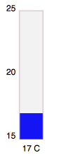
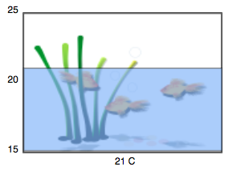
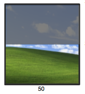
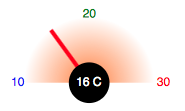
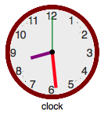
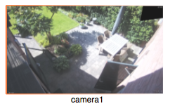

# pimatic-floorplan
Pimatic plugin for floorplans in the Pimatic gui

## Background
Pimatic's standard gui is pimatic-mobile-frontend. This standard gui gives a good and functional interface towards the Pimatic functions.
The interface is based on jQueryMobile and gives a structured page oriented layout to manage and control devices, rules, etc.

Some home-automation users want a more graphical representation of the gui. This plugin is build for that purpose and gives you the tools to be creative with the user interface.

## Description

This plugin adds a gui option to create 1 or more floorplan devices, for viewing and controlling existing pimatic devices. The concept is as follows:
- Scalable Vector Graphics (svg) as graphical base for a floorplan.
- Manual adding of devices that must be shown on the floorplan.
- Free choice of shapes for background and the pimatic devices, as long as they are linked to pimatic (see Linking the floorplan svg and pimatic).
- The supported devices are: switch, presence, contact, light, button, sensor (text/value display), sensor_bar, sensor_gauge, clock and camera.
- The states of an on/off switch, open/close contact, light, push/release button and present/absent presence sensor are all presented via colors. The colors are configurable. The light  will color depending on the color settings of the device its linked to.
- Attribute values can be shown via the sensor field. Optional you can add the acronym and unit of the used device.

## Preparation
Install the plugin the normal way via the pimatic plugins page or config.json.


## Creating a floorplan

Create a svg floorplan with a background of the room(s) your want to 'floorplan' and add graphics for the devices you want to use. A good and free program for this is [inkscape](https://inkscape.org). The ID tag of a sgv device object can be choosen freely but needs to be unique with one floorplan. The ID tag is used to connect to a pimatic device (see Linking the floorplan svg and pimatic).

Save the created svg file in the public folder of pimatic-mobile-frontend (pimatic-app/node_modules/pimatic-mobile-frontend/public. The filename (incl .svg) is use in the device config.

Create a floorplan device with the following configuration:
```
floorplan: "the sgv filename of the floorplan"
devices: "list of devices used in the floorplan"
  name: "The device name"
  svgId: "The ID tag used in the svg floorplan"
  type: "The gui type of device
     ["switch","button","presence","contact","light","sensor","sensor_bar","sensor_gauge"]
  pimatic_device_id: "The pimatic device Id"
  pimatic_attribute_name:" The attribute name of the Pimatic device like state, presence or temperature"
  format: "Optional JSON formatted attribute values"
```
Add pimatic devices by there device-id, give them a logical type and optional color the off-states. The default off color for all devices is #dddddd (light gray). The on-state colors are defined by the svg color of the object.

Make sure that floorplan devices are the last devices in the device list (the gui devices page).
After adding a floorplan please refresh the gui (incl clearing the cache)

## Linking the floorplan svg and pimatic

The linking between the svg objects and the pimatic devices devices is done in the floorplan config.
The svgId in pimatic floorplan device config must be the ID tag in the floorplan svg.

The svg device object that you create must have the option to fill it with a color. Otherwise the states colering will obviously not work.
The color, font size, etc of a text field (sensor values) must be set in the svg editor.

## Devices
#### Switch, Presence and Contact
The switch can be used in any svg object that has a color that can be set via the 'fill' attribute. By clicking on the drawing the device will toggle (on<->off) and go from on color to off color. The on color is defined by the svg drawing, the off color is default 'gray' or can be set in the format.
Format option is: colorOff

#### Light
The light can be used with any svg object that has a color and can be set via the 'fill' attribute. By clicking on the drawing the light will toggle (on<->off) and go from on color to off color. The on color is defined by the color of used pimatic light device. The off color is default 'gray' or can be set in the format.
Format option is: colorOff.

#### Sensor
The sensor will show the value of the used Pimatic device+attribute. For this floorplan device the svg type must be a TEXT field.


#### Sensor_bar
The sensor bar will show a Pimatic device+attribute value in a bar form. In the svg drawing a RECT type form must be used.
The color and transparancy you set in the svg is used in the bar.
In the format you can set a minimum and a maximum value ({'min':'\<number>'},'max':'\<number>'}). If not set the defaults 0 and 100 will be used. If min and max are set; min, mid and max labels are automatically created. Below the bar a text field is created with the actual value.

Below two examples, any shape is possible!

 or 

#### Shutter
The sensor will show the position of the shutter of the used Pimatic shutter device or variable. The svg setup is the same as for the sensor_bar. The shutter does not have labels on the left side for postion, only the current value below the bottom.

Below an example, any shape or window background is possible!



#### Sensor_gauge
The sensor gauge will show a Pimatic device+attribute value in a gauge form. In the svg drawing preferably a CIRCLE type form is used, but any other shape is possible. The dot (with actual value) an the needle are generated automatically.
In the format you can set a minimum and a maximum value ({'min':'\<number>'},'max':'\<number>'). If not set the defaults 0, 100 and 'red' will be used. The gauge is designed to work from left-top-right.

Below a gauge example.



#### Clock
The clock will show a analogue clock on any image or drawing. In the svg create the clock background. The second, minute and hour hands are automatically created.
In the device config format field, you can set the color, lenght and width of the hands. {'colorHour':'\<colorname or hex>','hourLength':\<number>, 'hourStroke':\<number>}. If the label option is set to true ({'label':true}, the label with the clock name is automatically created. There's no label if the label option is absent or label is set to false.

Below a clock example.




#### Camera
The camera will show a network stream (or image). In the svg create a RECT with the width/height ratio compatible with the image or stream (mostly 16:9).
In the device config format field, you must set the url of the image or stream {'camera':'http://.......'}. The pimatic-device and attribute is used for switching the camera on and off. Use a pimatic switch device for that. The label with the camera name is automatically created.

Below a camera example.



## Pan Zoom

A floorplan can be zoomed or panned. With a double click you go back to the startup fitted floorplan.

---
The plugin is in development. You could backup Pimatic before you are using this plugin!
